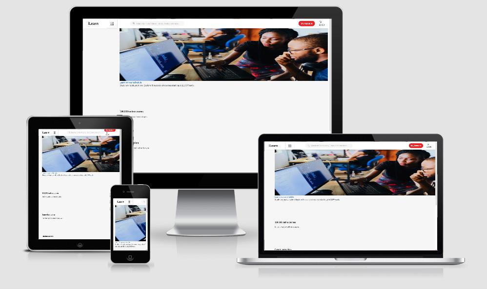
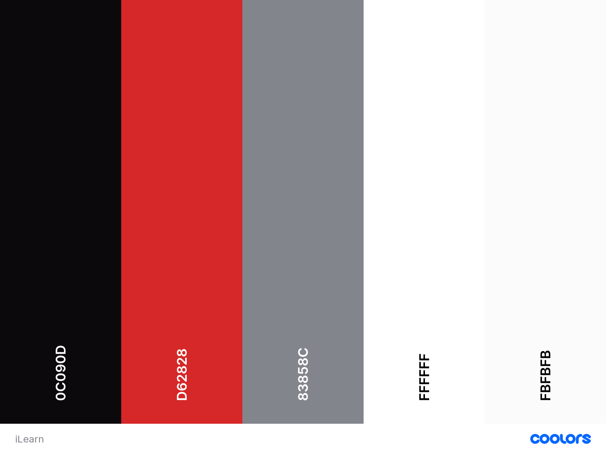

# iLearn - learning platform ☕️

</img>


<p>Welcome to iLearn platform - this e-commerce website developed by Patrycja Tyra as the final milestone project on the Code Institute Full-Stack web developer course. This website is inpired by udemy.com and made for people who would like to learn programming languages . If you would like to reach out to me please use my GitHub contact details.</p>

## Contents: 

- UX 👍
    - Project Goals
    - Target Audience Goals
    - Site Owner Goals
    - User Stories
    - User Requirements and Expectations
- Design Choices 🎨
    - Fonts
    - Icons
    - Colours
    - Styling
    - Images
    - Backgrounds
- Planning✏️
- Wireframes 🔧
    - Website Layout
    - Account Creation Flowchart
    - Database Design
- Features 🎡
    - Features that have been developed
    - Features that will be implemented in the future
- Technologies Used 👨‍💻
- Planning + Testing: ✏️ 🔌
- Bugs 🐞
- Deployment 🚀
	- Deploying to Heroku
    - Locally run this project
- Credits 💳
- Disclaimer

## User Experience: 👍

### Project Goals:
<p></p>

### Target Audience Goals:

* Browse various courses and be offered information about that course.
* Purchase products shown on the webstore.
* Create an account to track orders and purchase items on the webstore.
* A visually appealing and intuitive design.
* A website that is navigable on any device (mobile/tablet/desktop).
* Track orders made via profile dashboard.

### Site Owner Goals:

* Provide users with a safe and secure e-commerce platform in order to generate revenue from sales.
* Encourage user sales with promotions and discounts.
* Build awareness for the brand and attract new buyers.
* Collect user session data for market research purposes.

### User Stories:

<p>Jenny Says: "Ive been looking for a website for a while now that works just as well on my phone as it does my laptop, im far too busy to be sitting at my computer all day 
so I need a site that I can use just as well on my phone."</p>

<p>Tom Says: "Im often skeptical of buying online courses, I like to know that I have a line of communication with the company im paying with just incase there would be an issue
at some point down the line with the order."</p>

<p>Sarah Says: "Shopping on an e-commerce website has got to be easy, if you flood the user with too much choice you can cause them to panic and potentially leave the site and go elsewhere,
make it easy for the user to choose which items they want and buy them, simple!"</p>

### User Requirements and Expectations:
<p>When it comes to shopping on the web, users need to feel safe & comfortable in order for them to actually go through with purchases online, therefore providing the best UX, proper authentication
and using secure payment gateways (in this case Stripe) is necessary to offer the best solution.</p>

#### Requirements:

* Interact with a visually appealing and intuitive website.
* Navigate the website on any device, with ease.

* Add products to a shopping cart & update the cart quantities.
* Purchase products in the shopping cart in a safe and secure way.
* View orders in profile dashboard section.
* Can reach out to the business via email if needed.

#### Expectations:

* The Website will ensure safe storage of user details.
* The users payment information will not be stored in the website's database.
* The Website will load with sufficient speed.
* The Content on the website will be dynamic for any device.
* The Website will be navigable with ease.

## Design Choices: 🎨
<p>I wanted the design of this website to reflect the modern feel of the minima but vivid coloursby using gray, balck and white and some other colour</p>

### Fonts:

<p>I chose to use Roboto as the main font family for this website as it provides an elegant & clean style for text and titles. In the essence of keeping the layout clean to encourage user sales, I decided to go with this font.</p>

### Icons:

<p>Thanks to the excellent collection of icons over at uniicons, selecting icons to use for was really simple, I decided to go with typical icons for the  navbar, the cart, the user icon and the burger button, as well as using various other intutitive icons across the project. I use icons in place of link text across the site where possible to provide the best UX possible to the user.</p>

### Colours:
<p></p>

</img>

### Base Styles:


### Images:
<p>The banner image used on the website main banner have been sourced from royalty free image website <a href="https://unsplash.com/photos/2FPjlAyMQTA">here</a>. The images are related to learning and it helps to provide lifestyle imagery to the user and potentially entice them into making a purchase.</p>

## Wireframes/Flowcharts: 🔧
<p>I used Balsamiq</a> to develop the wireframes forthe website, this seemless tool allowed me to easily make a wireframe for each page aswell as a wireframe for each device. I could then easily export them via the tool to .png files in order to save to the project.</p> 

<p>The wireframes for this project can be seen <a href="https://github.com/patrycja-io/ilearn-milestone/tree/master/wireframes">here</a></p>


### Database Design:

* During development oI worked with the standard <strong>sqlite3</strong> database that comes installed with Django.
* In the production version othe database is a <strong>PostgreSQL</strong> database, hosted and provided by Heroku.

### Data Models:

The user model used in this project is that which is provided by Django, click <a href="https://docs.djangoproject.com/en/3.0/ref/contrib/auth/">here</a> to read more about those tables.


#### The Order Model:

The Order model within the checkout app holds the following data for the orders.

**Name**|**Key in db**|**Validation**|**Field Type**
:-----:|:-----:|:-----:|:-----:
order_number|ax_length=32, null=False, editable=False|CharField
user_profile|on_delete=models.SET_NULL,null=True, blank=True,related_name='orders'|ForeignKey
full_name|max_length=50, null=False, blank=False|CharField
email|(max_length=254, null=False, blank=False|EmailField
phone_number|max_length=20, null=False, blank=False|CharField
country|blank_label='Country *', null=False, blank=False|CountryField
postcode|max_length=20, null=True, blank=True|CharField
street_address1|max_length=40, null=False, blank=False|CharField
street_address2|max_length=80, null=False, blank=False|CharField
town_or_city|max_length=40, null=False, blank=False|CharField
county|max_length=80, null=True, blank=True|CharField
date|auto_now_add=True|DateTimeField
total|max_digits=10, decimal_places=2, null=False, default=0|DecimalField
original_baske|null=False, blank=False, default=''|TextField
stripe_pid|max_length=254, null=False, blank=False,default=''|CharField
checkout_order|max_length=254, null=False, blank=False,default=''|CharField

#### The OrderEbook Model:

The OrderEbook model within the checkout app holds the following data for the OrderItem(s) .

**Name**|**Key in db**|**Validation**|**Field Type**
:-----:|:-----:|:-----:|:-----:
Order|order|Order, null=False|ForeignKey
Product|product|Product, null=False|ForeignKey
Quantity|quantity|blank=False|IntegerField


#### The Category Model:

The Category model within the checkout app holds the following data for the orders.

**Name**|**Key in db**|**Validation**|**Field Type**
:-----:|:-----:|:-----:|:-----:
name|(max_length=254) friendly_name = models.CharField(max_length=254, null=True, blank=True)|CharField
friendly_name|max_length=254, null=True, blank=True|CharField


#### The Course Model:

The Course model within the checkout app holds the following data for the orders.

**Name**|**Key in db**|**Validation**|**Field Type**
:-----:|:-----:|:-----:|:-----:
category|'Category', null=True, blank=True, on_delete=models.SET_NULL|ForeignKey
sku|max_length=254, null=True, blank=True|CharField
name|max_length=254|CharField
description||TextField
price|max_digits=6, decimal_places=2|DecimalField
rating|max_digits=6, decimal_places=2, null=True, blank=True|DecimalField
image_url|max_length=1024, null=True, blank=True|URLField
image |null=True, blank=True|ImageField

#### The UserProfile:


The Course model within the checkout app holds the following data for the orders.

## Features: 🎡

### Features that have been developed:

* <p>Sliding search field in navbar.</p>
* <p>Search field - filtering search query by categories</p>
* <p>Account creation, user can login and view orders on profile dashboard.</p>
* <p>User can update their details further from the profile dashboard.</p>
* <p>A search bar that returns a list of products based on the users search query.</p>
* <p>A product list and product detail page so the user can click on individual products and find out more if they so wish.</p>
* <p>An active shopping cart that users can add or remove items from and also update the quantities inside.</p>
* <p>Users can take the cart full of items and checkout using the Stripe API which will process the payment details and place an order.</p>
* <p>Night Mode- user can shop in dark mode</p>

### Features that will be developed in the future:


* <p>Sending real emails</p>
* <p>A reset password link that will send the user a link to reset their password .</p>
* <p>Full integration of the sendgrid API: there are cname records which need to be set at domain level in order to fully utilise this API, however this was beyond the scope of the requried criteria as I do not have a physical domain for, just that which Heroku provides. Read more about the sendgrid integration in the planning & testing section below.</p>
* <p>Order confirmation emails to be sent to the customer upon placing an order.</p>
* <p>A promoted section where the users can see all of the products that are flagged as 'promoted' in the database.</p>

## Technologies Used: 👨‍💻
#### Languages:
* <a href="https://developer.mozilla.org/en-US/docs/Web/HTML">HTML</a>
* <a href="https://developer.mozilla.org/en-US/docs/Web/CSS">CSS</a>
* <a href="https://www.w3schools.com/js/">JavaScript</a>
* <a href="https://www.json.org/json-en.html">JSON</a>
* <a href="https://www.python.org/">Python</a>


#### Tools & Libraries: 

* <a href="https://jquery.com/">jQuery</a>
* <a href="https://git-scm.com/">Git</a>
* <a href="https://getbootstrap.com/">Bootstrap</a>
* <a href="https://fontawesome.com/icons?d=gallery">Font-Awesome</a>
* <a href="https://sass-lang.com/">SASS/SCSS</a>
* <a href="https://tinypng.com/">TinyPng (image compression)</a>
* <a href="https://sweetalert2.github.io/">Sweetalert2</a>
* <a href="https://pip.pypa.io/en/stable/installing/">PIP</a>
* <a href="http://whitenoise.evans.io/en/stable/">WhiteNoise</a>
* <a href="https://pypi.org/project/psycopg2/">Psycopg2</a>
* <a href="https://pypi.org/project/gunicorn/">Gunicorn</a>
* <a href="https://stripe.com/">Stripe</a>
* <a href="https://www.djangoproject.com/">Django</a>
* <a href="https://code.visualstudio.com/">Visual Studio Code</a>


#### Databases:

* <a href="https://www.postgresql.org/">PostgreSQL - Production</a>
* <a href="https://www.sqlite.org/index.html">SQlite3 - Development</a>

## Planning:  + Testing: ✏️ 🔌

#### Planning: 

<p>Planning for this project was extremely important, using and utilising new technology, frameworks, APIs and other tools can often be a challenge if you lack the correct preperation, continue reading to find out how each feature of was planned, tested, and how the feature works within the scope of the website.</p>

<p>Using the wireframes I built using sketch I was able to quickly build a base layout for the website, utilising component files where possible in order to provide resuable code in multiple areas across the website, thanks to the templating language that comes as standard with Django, this was an easy task.</p>

## Bugs 🐞

#### Bugs During Development: 

<p>Stripe Integration</p>

- <strong>Bug</strong> : During development of the stripe integration I had ran into an issue in which I could not get the website to process the order using a test card, in debugging mode I was being told that the 'stripe_id' is required to perform a purchase.
 
- <strong>Fix</strong> : The fix for this bug was irritatingly simple, because the Stripe JS code relies on the jQuery library I had to reorder the order in which I import the scripts in scripts.html so that jQuery was rendered before the stripe.js file.

- <strong>Verdict</strong> : The bug was squashed and orders could now be processed!

#### Bugs in final Release:

 <strong>Bug</strong> Whitenoise integration - causing lack of images in courses view and course page
 <strong>Bug</strong> Ending Order Confirmation- doesnt show payment details - instead of showing price that customer paid it shows 0
 <strong>Bug</strong> Unable to delete created courses as well as created users
 <strong>Bug</strong> Not able to get to checkout page - throws an error
 <strong>Bug</strong> Not able to register or log in user


## Deployment 🚀


### Running this project locally:

To run locally please follow the steps below!

Before starting make sure you have the following:

* An IDE (interactive development environment) such as <a href="https://code.visualstudio.com/">Visual Studio Code</a>.
* You <strong>MUST</strong> have the following installed on your machine>
* * <a href="https://pip.pypa.io/en/stable/installing/">PIP</a>
* * <a href="https://www.python.org/">Python3</a>
* * <a href="https://git-scm.com/">Git</a>
* You will <strong>need to</strong> create accounts with the following online services in order to run this project.
* * <a href="https://stripe.com/">Stripe</a>

## Instructions:

<em>WARNING: You may need to follow a different guide based on the OS you are using, read more <a href="https://python.readthedocs.io/en/latest/library/venv.html">here.</a></em>


* 1: <strong>Clone</strong> repository by either downloading from <a href="https://github.com/patrycja-io/ilearn-milestone.git">here</a> or type the following command into your terminal.
```bash
git clone https://github.com/

* 2: <strong>Navigate</strong> to this folder in your terminal.
* 3: <strong>Enter</strong> the following command into your terminal.
```bash
python3 -m .venv venv
```
* 4: <strong>Initialize</strong> the environment by using the following command.
```bash
.venv\bin\activate
```

* 5: <strong>Install</strong> the requirements and dependancies from the requirements.txt file
```bash
pip3 -r requirements.txt
```

* 6: Within your IDE now <strong>create</strong> a file where you can store your secret information for the app, I used vscodes settings.json however you can just create an env.py file if you wish.

```bash
{
    "python.pythonPath": "/usr/local/bin/python3",
    "python.terminal.activateEnvironment": true,
    "python.linting.enabled": true,
    "files.autoSave": "onFocusChange",
    "files.useExperimentalFileWatcher": true,
    "terminal.integrated.env.osx": {
      "SECRET_KEY": "<your_secret_key_here>",
      "DEV": "1",
      "SENDGRID_API_KEY": "<your_sendgrid_api_key_here>",
      "STRIPE_PUBLISHABLE": "<your_stripe_publishable_key_here>",
      "STRIPE_SECRET": "<your_stripe_secret_key_here>",
      "DATABASE_URL": "<your_database_url_here>",
}
```

* 7: <strong>Enter</strong> the following command into the terminal to migrate models into database.
```bash
python3 manage.py migrate
```

* 8: Then you need to <strong>Create</strong> a 'superuser' for the project using the terminal, enter the following command.
```bash
python3 manage.py createsuperuser
```

* 9: The app can now be ran locally using the following command.
```bash
python3 manage.py runserver
```

Congratulations,is now running locally on your machine! Happy Coding!

### Deploying  to Heroku:

* 1: <strong>Create</strong> a requirements.txt file using the following command.
```bash
pip3 freeze > requirements.txt
```

* 2: <strong>Create</strong> a procfile with the following command.
```bash
echo web: python3 app.py > Procfile
```
* 3: Push these newly created files to your repository.
* 4: Create a new app for this project on the Heroku Dashboard.
* 5: Select your deployment method by clicking on the deployment method button and select GitHub.
* 6: On the dashboard, set the following config variables:

**Key**|**Value**
:-----:|:-----:
DATABASE\_URL|<your\_database\_url>
SECRET\_KEY|<your\_secret\_key>
SENDGRID\_API\_KEY|<your\_sendgrid\_api\_key>
STRIPE\_PUBLISHABLE|<your\_stripe\_publishable\_key>
STRIPE\_SECRET|<your\_stripe\_secret\_key>

* 7: <strong>Click</strong> the deploy button on the heroku Dashboard.
* 8: Wait for the build to finish and click the view project link once it has!

Congratulations, is now hosted on Heroku and is live!

## Credits 💳

* <a href="https://medium.com/developing-with-sass/creating-a-dead-simple-sass-mixin-to-handle-responsive-breakpoints-889927b37740">Mixin For Breakpoints</a>
* <a href="https://www.favicon-generator.org/">Favicon Generator</a>  
* <a href="https://coolors.co/">Coolors.co</a>
* <a href="https://chrome.google.com/webstore/detail/unicorn-revealer/lmlkphhdlngaicolpmaakfmhplagoaln?hl=en-GB">Unicorn Revealer</a>
* <a href="https://unsplash.com/">Unsplash - Royalty Free Images</a>
* <a href="https://www.sh.co.uk/"> Images & Content</a>
* <a href="https://ironandfire.co.uk/"> Images & Content</a>

## Disclaimer
The contents of th

## Acknowledgements
The project is inspired by my experience made so far in software developmet.

Manny thanks to my Code Institute Tutors team, especially Anna Greaves, and Samantha with their endless willing to help and patience with my lack of knowlegde.

Special thanks to my Code Institute Mentor Simen Daehlin for his coding expertise, endless patience and generosity with his time.